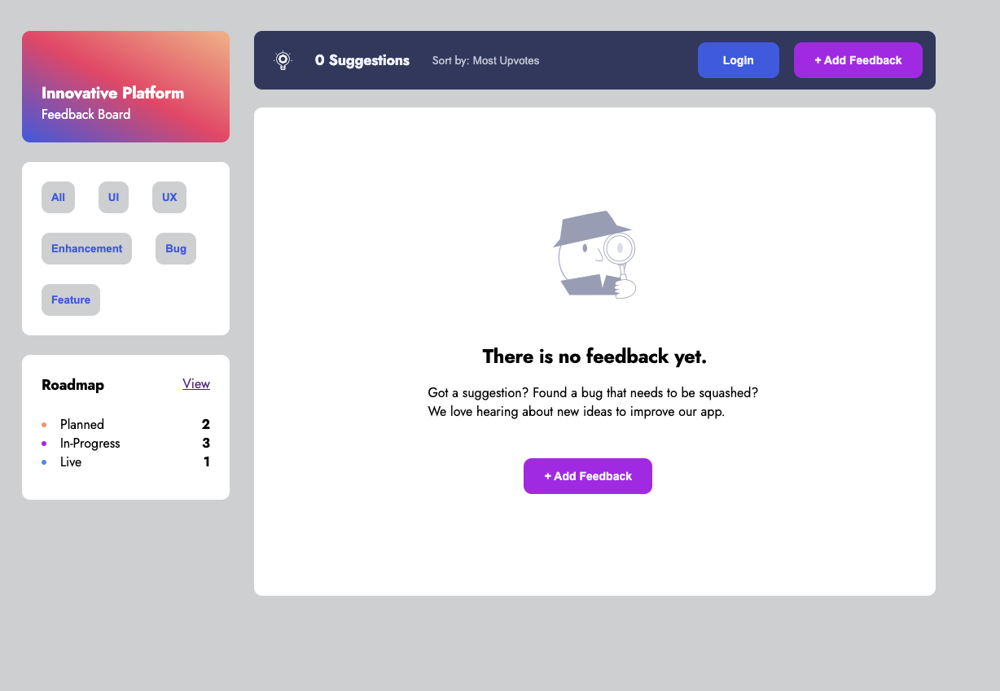

# Product Feedback App

This is a product feedback web application that I have built that allows users to provide feedback and suggestions to improve the application, as well as share ideas related to their current work. The website is a full stack application that enables users to create an account and contribute to the forum. The design for the website was inspired by a Figma file provided by [Frontend Mentor](https://www.frontendmentor.io/challenges/product-feedback-app-wbvUYqjR6). As the sole developer, I designed and built the back-end API, showcasing my proficiency in back-end development and API design.

---
## Table of contents

- [Overview](#overview)
  - [The challenge](#the-challenge)
  - [Screenshot](#screenshot)
  - [Links](#links)
- [My process](#my-process)
  - [Built with](#built-with)
- [Author](#author)
- [Acknowledgments](#acknowledgments)

---
## Overview

### The challenge

Users should be able to:

- View the optimal layout for the app depending on their device's screen size
- See hover states for all interactive elements on the page
- Create, read, update, and delete product feedback requests
- Receive form validations when trying to create/edit feedback requests
- Sort suggestions by most/least upvotes
- Filter suggestions by category
- Add comments and replies to a product feedback request
- Upvote product feedback requests
- Sign up and Sign in
- Upload a custom photo of themselves when signing up

---
### Screenshot

  
Desktop

  <h4>Homepage</h4>
  
  <h4>No Feedback Page</h4>
  
  <h4>New Feedback Page</h4>
  
  <h4>Edit Feedback Page</h4>
  
  <h4>Roadmap</h4>
  
  <h4>Login</h4>
  
  <h4>Sign up</h4>
  

  
Tablet

  <h4>Homepage</h4>
  

  
Mobile

  <h4>Homepage</h4>
  

 

---

### Links

- Live Site URL: [Product Feedback App - Heroku](https://frozen-everglades-95667.herokuapp.com/)

## My process

### Built with

- Semantic HTML5 markup
- [SASS](https://sass-lang.com/) - CSS Library
- Javascript
- [Handlebars](https://handlebarsjs.com/) - JS library
- [Sequelize](https://sequelize.org/) - Node.js ORM
- [Node.js](https://nodejs.org/en) - Javascript Runtime Environment
- [MySql](https://www.mysql.com/) - Database
- [Express](https://expressjs.com/) - Node.js Framework
- [MongoDB Atlas](https://www.mongodb.com/) - Cloud Database
- [Heroku](https://www.heroku.com/) - Deployment Platform

---

## Author

- Website - [Takuya Matsumoto](https://www.your-site.com)
- Twitter - [@TakuyaMats](https://www.twitter.com/TakuyaMats)
- Linkedin - [takuyamatsumoto90](https://www.linkedin.com/in/takuyamatsumoto90/)

---
## Acknowledgments
 

With new innovations emerging seemingly every day, Chat GPT is one of the most notable, and I've come to see it not as a threat but as another valuable tool for developers. As a solo developer, I approached this project like any other, leveraging all the resources at my disposal to build a large-scale project. While I was aware of Chat GPT's existence since its release in November 2022, I only incorporated it into my workflow in March when version 4 was released. Looking back, I wish I had used this tool earlier because of how efficient it has made my workflow. By generating code snippets, identifying syntax errors, and suggesting improvements, Chat GPT has greatly reduced the amount of code I've had to write. In addition, Chat GPT has been an invaluable learning resource for web development, answering questions on a wide range of topics, including programming languages, frameworks, software architecture, and design patterns. I'm grateful for Chat GPT's versatility and powerful assistance, and I want to give a huge shout-out to the tool for helping me improve my coding abilities and deepen my understanding of web development concepts.